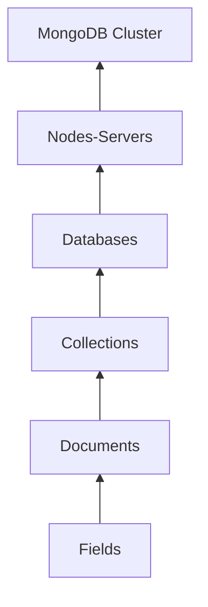
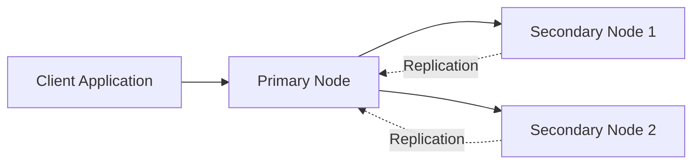
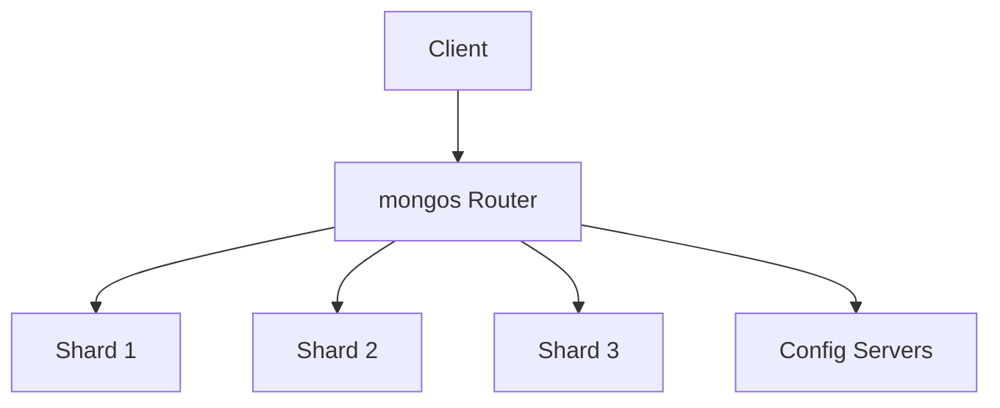
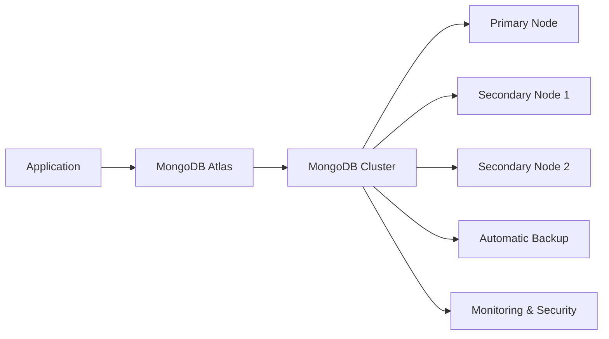
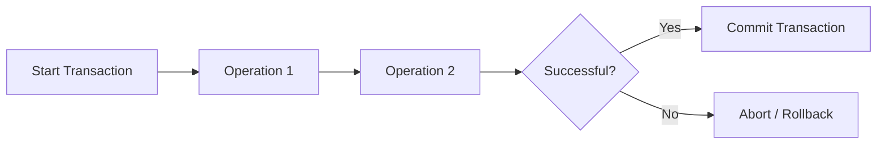

# Question 1

## Design and create a MongoDB database named `college` to manage student information. Design the student document with appropriate fields such as Student ID, Name, Department, CGPA, Email, and Skills. Write the appropriate MongoDB (mongosh or PyMongo) commands to perform the following operations:

1. Create the `college` database.
2. Create a `students` collection.
3. Insert a single student document.
4. Insert multiple student documents.
5. Retrieve all student documents.
6. Retrieve students belonging to the CSE department.
7. Display only the Name and CGPA fields of all students.
8. Update the CGPA of a student using the Student ID.
9. Delete a student document using the Student ID.
10. Display the total number of student documents in the collection.

---

# Answer

MongoDB is a NoSQL document-oriented database that stores data as BSON documents. For this question, a database named **`college`** is created to manage student information. The database contains a **`students`** collection, where each document represents one student. The document is designed with the fields **Student ID, Name, Department, CGPA, Email, and Skills**.

## Student Document Design

A suitable student document is shown below.

```json
{
    "_id": ObjectId("..."),
    "student_id": 101,
    "name": "Alice Johnson",
    "department": "CSE",
    "cgpa": 9.1,
    "email": "alice@college.edu",
    "skills": [
        "Python",
        "MongoDB",
        "Machine Learning"
    ]
}
```

The fields are described below:

| Field | Description |
|--------|-------------|
| `_id` | Automatically generated unique identifier |
| `student_id` | Unique student identification number |
| `name` | Name of the student |
| `department` | Department of the student |
| `cgpa` | Student's academic performance |
| `email` | Student's email address |
| `skills` | Array containing technical skills |

## 1. Create the `college` Database

```javascript
use college
```

The `use` command creates the **college** database if it does not already exist and switches the current database to it.

## 2. Create the `students` Collection

```javascript
db.createCollection("students")
```

This command creates a collection named **students** to store student documents.

## 3. Insert a Single Student Document

```javascript
db.students.insertOne({
    student_id:101,
    name:"Alice Johnson",
    department:"CSE",
    cgpa:9.1,
    email:"alice@college.edu",
    skills:["Python","MongoDB","Machine Learning"]
})
```

The `insertOne()` method inserts a single document into the collection.

## 4. Insert Multiple Student Documents

```javascript
db.students.insertMany([
{
    student_id:102,
    name:"Bob Smith",
    department:"ECE",
    cgpa:8.6,
    email:"bob@college.edu",
    skills:["C","Embedded Systems"]
},
{
    student_id:103,
    name:"Charlie",
    department:"CSE",
    cgpa:8.9,
    email:"charlie@college.edu",
    skills:["Java","Python"]
}
])
```

The `insertMany()` method inserts multiple student documents in one operation.

## 5. Retrieve All Student Documents

```javascript
db.students.find()
```

The `find()` method retrieves all documents stored in the **students** collection.

## 6. Retrieve Students Belonging to the CSE Department

```javascript
db.students.find({
    department:"CSE"
})
```

This query filters the documents and returns only students whose department is **CSE**.

## 7. Display Only the Name and CGPA Fields

```javascript
db.students.find(
    {},
    {
        name:1,
        cgpa:1,
        _id:0
    }
)
```

Projection is used to display only the **Name** and **CGPA** fields while excluding the `_id` field.

## 8. Update the CGPA of a Student Using the Student ID

```javascript
db.students.updateOne(
    {student_id:101},
    {$set:{cgpa:9.4}}
)
```

The `updateOne()` method updates the CGPA of the student whose Student ID is **101**.

## 9. Delete a Student Document Using the Student ID

```javascript
db.students.deleteOne({
    student_id:102
})
```

The `deleteOne()` method removes the student document that matches the specified Student ID.

## 10. Display the Total Number of Student Documents

```javascript
db.students.countDocuments()
```

The `countDocuments()` method returns the total number of documents present in the **students** collection.


> The **college** database is successfully designed using a **students** collection with appropriate fields such as Student ID, Name, Department, CGPA, Email, and Skills. The required MongoDB operations including database creation, collection creation, document insertion, retrieval, projection, update, deletion, and document counting are performed using the appropriate MongoDB commands.

---

# Question 2

## Draw and explain the MongoDB architecture hierarchy. Discuss BSON, ObjectId, flexible schema, embedded documents, and referencing

---

# Answer

MongoDB follows a hierarchical architecture to organize and manage data efficiently. At the highest level is a **MongoDB Cluster**, which consists of one or more **Nodes (Servers)**. Each node stores one or more **Databases**. A database contains multiple **Collections**, each collection stores multiple **Documents**, and every document consists of **Fields** represented as key-value pairs. MongoDB stores these documents internally in **BSON (Binary JSON)** format, allowing efficient storage and retrieval of data.

## MongoDB Architecture Hierarchy

The following figure shows the complete MongoDB hierarchy.



### Explanation of the Hierarchy

| Level | Description |
|--------|-------------|
| **Cluster** | A cluster is the highest level of MongoDB deployment. It consists of one or more MongoDB nodes working together to provide scalability and high availability. |
| **Node (Server)** | A node is an individual MongoDB server that stores databases and processes client requests. Multiple nodes can exist within a cluster. |
| **Database** | A database is a logical container that groups related collections. For example, a college may have a database named **college**. |
| **Collection** | A collection is similar to a table in a relational database. It stores multiple documents of the same category. For example, the **students** collection stores student information. |
| **Document** | A document is a single record stored in BSON format. Each document contains related information about one entity. |
| **Fields** | Fields are key-value pairs inside a document that store the actual data, such as student name, CGPA, and department. |

### Example

Consider a **college** database.

```text
MongoDB Cluster
    └── Node
          └── Database : college
                └── Collection : students
                      └── Document
                             ├── student_id : 101
                             ├── name : "Alice Johnson"
                             ├── department : "CSE"
                             ├── cgpa : 9.1
                             ├── email : "alice@college.edu"
                             └── skills : ["Python","MongoDB"]
```

In this example:

- The **MongoDB Cluster** contains one or more nodes.
- One **Node** stores the **college** database.
- The **college** database contains the **students** collection.
- The **students** collection stores multiple student documents.
- Each **document** represents one student and contains several **fields**.

---

## BSON (Binary JSON)

MongoDB stores documents internally using **BSON (Binary JSON)** instead of standard JSON. BSON extends JSON by supporting additional data types such as **ObjectId, Date, Timestamp, Decimal128, Binary Data, and Regular Expressions**. Since BSON is stored in binary format, it provides efficient storage, faster traversal, and improved query performance.

### Example

```json
{
    "_id": ObjectId("687c1e4d4b2d51b6b6f31c21"),
    "student_id": 101,
    "name": "Alice Johnson",
    "department": "CSE",
    "cgpa": 9.1,
    "admission_date": ISODate("2025-06-15T00:00:00Z")
}
```

### Explanation

In this document:

- `_id` is stored as an **ObjectId**.
- `student_id` is stored as an **Integer**.
- `cgpa` is stored as a **Double**.
- `admission_date` is stored as a **Date** object.

These specialized data types are supported by BSON but not by standard JSON. BSON therefore enables MongoDB to efficiently store and process different types of application data.

---

## ObjectId

Every MongoDB document contains a unique **`_id`** field. If the user does not specify this field, MongoDB automatically generates an **ObjectId**. An ObjectId is a **12-byte unique identifier** consisting of:

- **4 bytes** – Timestamp
- **5 bytes** – Random value
- **3 bytes** – Incrementing counter

### Example

```json
{
    "_id": ObjectId("687c1e4d4b2d51b6b6f31c21"),
    "student_id": 101,
    "name": "Alice Johnson"
}
```

### Explanation

In this example, the `_id` field uniquely identifies the student document.

For example:

- Alice → `ObjectId("687c1e4d4b2d51b6b6f31c21")`
- Bob → `ObjectId("687c1e4d4b2d51b6b6f31c22")`

Even if two students have the same name, MongoDB can uniquely identify each document using the `_id` field. Since `_id` is automatically indexed, searching for documents using this field is highly efficient.

## Flexible Schema

Unlike relational databases, MongoDB does not require every document in a collection to have the same structure. Documents in the same collection can contain different fields based on application requirements. This feature is known as a **Flexible Schema** or **Schema-less Design**.

### Example

Suppose the **students** collection contains the following documents.

**Document 1**

```json
{
    "student_id": 101,
    "name": "Alice Johnson",
    "department": "CSE"
}
```

**Document 2**

```json
{
    "student_id": 102,
    "name": "Bob Smith",
    "department": "ECE",
    "cgpa": 8.8
}
```

**Document 3**

```json
{
    "student_id": 103,
    "name": "Charlie",
    "department": "AI",
    "cgpa": 9.2,
    "skills": [
        "Python",
        "Machine Learning"
    ]
}
```

### Explanation

All three documents belong to the **students** collection, but they contain different fields.

- Student 1 contains only basic information.
- Student 2 additionally stores the CGPA.
- Student 3 stores both CGPA and technical skills.

Unlike a relational database, MongoDB does not require every document to contain identical columns. New fields can be added whenever required without modifying existing documents. This flexibility makes MongoDB suitable for applications whose data structure changes over time.

---

## Embedded Documents

An **Embedded Document** stores related information inside the parent document. Embedding is useful when the related data belongs only to that document and is frequently accessed together.

### Example

```json
{
    "student_id": 101,
    "name": "Alice Johnson",
    "department": "CSE",
    "address": {
        "house_no": "12-45",
        "street": "MG Road",
        "city": "Hyderabad",
        "state": "Telangana",
        "pincode": 500001
    }
}
```

### Explanation

In this example, the student's address is stored inside the student document.

Whenever the student document is retrieved, the complete address is also retrieved in a single query. This reduces the need for joins and improves read performance.

Embedded documents are suitable when:

- Related data belongs to only one document.
- The related data is always accessed together.
- The embedded data is relatively small and changes infrequently.

---

## Referencing

**Referencing** stores related data in separate collections and links them using identifiers. This approach reduces data duplication and improves data consistency.

### Example

**Departments Collection**

```json
{
    "_id": "CSE",
    "department_name": "Computer Science and Engineering",
    "hod": "Dr. Ramesh Kumar"
}
```

**Students Collection**

```json
{
    "student_id": 101,
    "name": "Alice Johnson",
    "department_id": "CSE"
}
```

### Explanation

Instead of storing the complete department information inside every student document, only the `department_id` is stored. The remaining department details are maintained separately in the **Departments** collection.

Suppose 2,000 students belong to the CSE department. If the Head of Department changes, only **one document** in the Departments collection needs to be updated instead of updating 2,000 student documents.

Referencing is preferred when:

- Multiple documents share the same information.
- The related data changes frequently.
- The relationship is one-to-many or many-to-many.
- Data duplication should be minimized.

---

## Embedded Documents vs Referencing

| Feature | Embedded Documents | Referencing |
|---------|--------------------|-------------|
| Storage | Related data stored inside the parent document | Related data stored in separate collections |
| Query Performance | Faster because data is retrieved in one query | May require multiple queries or `$lookup` |
| Data Duplication | Higher | Lower |
| Best Use Case | One-to-one or one-to-few relationships | One-to-many or many-to-many relationships |
| Example | Student and Address | Student and Department |

---

# Question 3

**Compare Replica Sets and Sharding in MongoDB. Explain the role of MongoDB Atlas, transactions, and ACID vs BASE properties in building scalable and highly available applications.**

# Answer

MongoDB provides several mechanisms to ensure **high availability**, **fault tolerance**, and **horizontal scalability**. **Replica Sets** improve availability by maintaining multiple copies of data, while **Sharding** distributes data across multiple servers to handle very large datasets and high workloads. These features are complemented by **MongoDB Atlas**, which offers a managed cloud platform, and **Transactions**, which ensure data consistency. Together, they enable MongoDB to build scalable and reliable distributed database systems.

---

# Replica Sets

A **Replica Set** is a group of MongoDB servers that maintain the same copy of data. One server acts as the **Primary**, while the remaining servers act as **Secondary** nodes. All write operations are performed on the Primary node, and the changes are automatically replicated to the Secondary nodes.

If the Primary node fails, one of the Secondary nodes is automatically elected as the new Primary. This process is called **automatic failover**, ensuring that the database remains available without manual intervention.

## Replica Set Architecture



### Example

Consider an online banking application.

- **Primary Node** stores all customer transactions.
- **Secondary Node 1** and **Secondary Node 2** maintain identical copies of the data.

Suppose a customer transfers ₹10,000.

1. The write request is sent to the **Primary Node**.
2. The Primary updates the database.
3. The updated data is replicated to both Secondary nodes.

If the Primary server crashes due to hardware failure, MongoDB automatically elects one of the Secondary nodes as the new Primary. The application continues to operate with minimal interruption.

### Advantages of Replica Sets

- Provides high availability.
- Supports automatic failover.
- Maintains multiple copies of data.
- Prevents data loss.
- Secondary nodes can serve read operations (when configured), reducing the load on the Primary.

---

# Sharding

As applications grow, a single server may not have enough storage capacity or processing power. **Sharding** addresses this problem by distributing data across multiple servers called **Shards**.

Instead of storing the entire database on one machine, MongoDB divides the data into smaller partitions based on a **Shard Key**. Each shard stores only a portion of the data, allowing the system to scale horizontally.

## Sharded Cluster Architecture



### Components of a Sharded Cluster

| Component | Purpose |
|-----------|---------|
| **mongos Router** | Receives client requests and routes them to the appropriate shard. |
| **Shard** | Stores a subset of the data. |
| **Config Servers** | Store metadata about the distribution of data across shards. |
| **Shard Key** | Determines how documents are distributed among shards. |

### Example

Consider an e-commerce company storing **50 million customer orders**.

Instead of storing all orders on a single server, MongoDB distributes them across multiple shards.

| Shard | Data Stored |
|--------|-------------|
| Shard 1 | Orders from customers A–H |
| Shard 2 | Orders from customers I–P |
| Shard 3 | Orders from customers Q–Z |

When a customer places a new order, the **mongos Router** determines the appropriate shard using the shard key and forwards the request to that shard.

This distribution offers several benefits:

- Storage capacity increases by adding more shards.
- Write operations are distributed across multiple servers.
- Query performance improves because different shards process requests in parallel.

### Advantages of Sharding

- Enables horizontal scalability.
- Supports very large databases.
- Improves write throughput.
- Distributes workload across multiple servers.
- Allows additional shards to be added as data grows.

---

## Replica Sets vs Sharding

| Feature | Replica Set | Sharding |
|---------|-------------|-----------|
| Primary Purpose | High Availability | Horizontal Scalability |
| Data Storage | Complete copy on every node | Data divided across multiple shards |
| Failover | Automatic | Depends on replica sets within shards |
| Read Scaling | Yes (using secondary reads) | Yes |
| Write Scaling | Limited | Excellent |
| Best Use Case | Critical systems requiring continuous availability | Very large databases with massive workloads |

## MongoDB Atlas

**MongoDB Atlas** is the fully managed cloud database service provided by MongoDB. It allows developers to deploy, monitor, secure, and scale MongoDB databases without managing the underlying infrastructure. Atlas supports deployment on major cloud providers such as **Amazon Web Services (AWS), Microsoft Azure, and Google Cloud Platform (GCP)**.

### MongoDB Atlas Architecture



### Example

Suppose a company develops an online shopping application.

Instead of purchasing servers, installing MongoDB, configuring Replica Sets, and taking backups manually, the company deploys the database on **MongoDB Atlas**.

MongoDB Atlas automatically provides:

- Replica Sets for high availability.
- Automated backups and recovery.
- Performance monitoring.
- Security features such as authentication and encryption.
- Automatic scaling as the application grows.

Thus, developers can focus on application development rather than database administration.

### Advantages of MongoDB Atlas

- Fully managed cloud database.
- Automatic software updates.
- Automatic backups and recovery.
- Built-in security.
- Easy scalability.
- High availability through Replica Sets.

---

# Transactions

A **Transaction** is a sequence of one or more database operations that execute as a single unit of work. Either **all operations succeed** or **all operations fail**. Transactions ensure that the database remains in a consistent state even if an error occurs during execution.

### Transaction Workflow



### Example

Consider a bank transfer of **₹5,000** from **Account A** to **Account B**.

The transaction consists of two operations:

1. Deduct ₹5,000 from Account A.
2. Add ₹5,000 to Account B.

If both operations complete successfully, MongoDB **commits** the transaction.

If the system crashes after deducting money from Account A but before adding it to Account B, MongoDB **rolls back** the transaction. As a result, neither account is modified, ensuring data consistency.

Transactions are commonly used in banking, e-commerce, inventory management, and financial systems where multiple related operations must succeed together.

---

# ACID Properties

MongoDB supports **ACID transactions** for multi-document operations.

| Property | Description |
|----------|-------------|
| **Atomicity** | All operations in a transaction are completed successfully or none are executed. |
| **Consistency** | Every transaction moves the database from one valid state to another. |
| **Isolation** | Concurrent transactions do not interfere with each other. |
| **Durability** | Once committed, data is permanently stored even after a system failure. |

### Example

In the bank transfer example:

- **Atomicity:** Money is deducted and credited together.
- **Consistency:** Total balance remains unchanged.
- **Isolation:** Other users cannot see partial updates.
- **Durability:** After commit, the transaction remains stored even if the server crashes.

---

# BASE Properties

Distributed NoSQL databases often follow the **BASE** model to improve scalability and availability.

| Property | Description |
|----------|-------------|
| **Basically Available** | The system remains available even if some nodes fail. |
| **Soft State** | Data may change over time due to replication. |
| **Eventual Consistency** | All replicas eventually contain the same data after synchronization. |

### Example

Suppose an e-commerce application updates the stock of a product.

Immediately after the update:

- Primary Node shows **Stock = 20**
- Secondary Node still shows **Stock = 25**

After replication completes, all nodes display **Stock = 20**. This behavior is called **Eventual Consistency**.

---

# ACID vs BASE

| Feature | ACID | BASE |
|---------|------|------|
| Goal | Strong consistency | High availability and scalability |
| Consistency | Immediate | Eventual |
| Transactions | Fully supported | Limited or eventual |
| Availability | May decrease during failures | High |
| Suitable For | Banking, finance, inventory | Social media, e-commerce, IoT |

---
